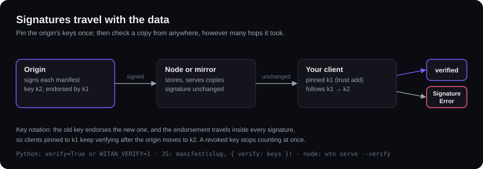

# Trust

Every version manifest the origin hands out is signed with Ed25519, and nodes and mirrors pass the signature through unchanged. You pin the origin's keys once, where you trust the origin, and check a manifest from anywhere against them. The SDK follows key rotations through endorsements and refuses revoked keys.



## Pin the origin's keys

`keys()` reads the keys the origin signs with, from `/.well-known/witan-keys`. It needs no API key. It returns a `SigningKeys` object: `origin`, `keys` (each with `kid`, `alg: "Ed25519"`, `publicKey` in base64, and `status`: `"current"`, `"retired"` or `"revoked"`) and `endorsements`.

```ts
import { Witan } from "witan-sdk";

const origin = new Witan({ baseUrl: "https://witan.example" });   // the origin you trust
const pinned = await origin.keys();
console.log(JSON.stringify(pinned));   // store this with your agent's config
```

Do this once, from a place you trust, and store the JSON. Keys fetched next to every manifest, from the same server, would only check that server against itself.

## Verify a manifest

Pass the pinned keys to `projects.manifest` as `verify`, and the signature is checked before the manifest is returned. The manifest can come from the origin, a node or a mirror:

```ts
const node = new Witan({ baseUrl: "http://127.0.0.1:8686", apiKey: "node" });
const m = await node.projects.manifest("agent-api-observatory", { verify: pinned });   // an origin version, served by a node
```

For a manifest you already hold, call `verifyManifest(manifest, keys, { require })`. It resolves `"verified"`, or `"unsigned"` when the manifest carries no signature. Versions written on a node are the node's own and unsigned. With `require: true` an unsigned manifest throws; `projects.manifest` with `verify` always requires a signature.

```ts
import { SignatureError, verifyManifest } from "witan-sdk";

try {
  const result = await verifyManifest(m, pinned);   // "verified" | "unsigned"
} catch (e) {
  if (e instanceof SignatureError) console.error("refused:", e.message);
  else throw e;
}
```

Both throw `SignatureError` when the manifest:

- is signed for another origin than the pinned keys' `origin`;
- uses an algorithm other than Ed25519;
- is signed with a key the pinned set marks `"revoked"`;
- is signed with a key that is not pinned and that no endorsement in the signature leads to from a pinned key;
- carries an endorsement that is malformed or does not verify;
- does not match its signature: the manifest was altered or corrupted.

## What the signature covers

`signedStatement(manifest, origin)` returns the exact string the origin signs: `{ v: 1, origin, manifest }` as JSON with sorted keys and no whitespace. The manifest in it leaves out `signature`, `urlExpiresAt`, `paid` and each part's `url`. A manifest with fresh download URLs from any mirror therefore still verifies, while the version, totals, schema and each part's `sha256`, `records` and `bytes` are covered.

The SDK does not download parts. When you do, check each one against its `sha256`:

```ts
async function sha256Hex(data: ArrayBuffer): Promise<string> {
  const digest = new Uint8Array(await crypto.subtle.digest("SHA-256", data));
  return [...digest].map((b) => b.toString(16).padStart(2, "0")).join("");
}

for (const part of m.parts) {
  const bytes = await (await fetch(part.url)).arrayBuffer();   // valid until m.urlExpiresAt
  if ((await sha256Hex(bytes)) !== part.sha256) throw new Error(`part ${part.sha256} does not match`);
}
```

## Key rotation

When the origin rotates its key, the old key endorses the new one. An endorsement is the old key's signature over `endorsementStatement(origin, newKey)`, and every signature carries the links from earlier keys to its key as `chain`, oldest first. `verifyManifest` walks that chain from your pinned keys, so a rotation needs no change on your side. A revoked key vouches for nothing.

To refresh the stored keys, apply a fresh `keys()` document with `updatePinnedKeys(pinned, published, { force })`. It does not trust the document blindly:

| Result field | What it lists |
|---|---|
| `keys` | The new pinned set. Store it in place of the old one. |
| `added` | Keys a pinned key endorsed, directly or through a chain. |
| `revoked` | Pinned keys the origin newly marks revoked; they stay in `keys` with `status: "revoked"`. |
| `refused` | Published keys no pinned key leads to. They are not added. |

```ts
import { updatePinnedKeys } from "witan-sdk";

const { keys: next, added, refused, revoked } = await updatePinnedKeys(pinned, await origin.keys());
console.log(`added: ${added.join(", ") || "none"}; revoked: ${revoked.join(", ") || "none"}`);
if (refused.length) console.warn(`keys without an endorsement: ${refused.join(", ")}`);
// store `next` in place of `pinned`
```

A non-empty `refused` means the origin re-keyed without an endorsement, for example after a leaked key. Check the key ids with the origin's operator, then call `updatePinnedKeys(pinned, published, { force: true })` to add them. Even then, a key whose `kid` is not derived from its public key throws `SignatureError`, and so does a document for another origin.

## Pinned keys in a serverless function

A `SigningKeys` object is plain JSON, so store it where the function reads its configuration. The SDK reads no variable for it; the names below are your own.

- **An environment variable or secret.** Read-only at run time; you refresh it by redeploying. `const pinned = JSON.parse(process.env.WITAN_PINNED_KEYS!) as SigningKeys;`
- **A key-value store** (Cloudflare KV, or your platform's equivalent). The function can then refresh the keys itself on a schedule.

```ts
import { Witan, updatePinnedKeys, type SigningKeys } from "witan-sdk";

interface Env { WITAN_BASE_URL: string; WITAN_API_KEY: string; TRUST: KVNamespace }

export default {
  async fetch(_request: Request, env: Env): Promise<Response> {
    const pinned = await env.TRUST.get<SigningKeys>("pinned-keys", "json");
    if (!pinned) return new Response("no pinned keys", { status: 500 });
    const w = new Witan({ baseUrl: env.WITAN_BASE_URL, apiKey: env.WITAN_API_KEY });
    const m = await w.projects.manifest("agent-api-observatory", { verify: pinned });
    return Response.json({ version: m.version, records: m.totals.records });
  },
  async scheduled(_controller: ScheduledController, env: Env): Promise<void> {
    const pinned = await env.TRUST.get<SigningKeys>("pinned-keys", "json");
    if (!pinned) return;
    const r = await updatePinnedKeys(pinned, await new Witan({ baseUrl: env.WITAN_BASE_URL }).keys());
    if (r.added.length || r.revoked.length) await env.TRUST.put("pinned-keys", JSON.stringify(r.keys));
    if (r.refused.length) console.warn("refused keys:", r.refused);
  },
};
```

Seed the store once with the JSON from `keys()`, fetched where you trust the origin. Never pass `force: true` from a scheduled job.

## WebCrypto Ed25519 by runtime

Verification uses the runtime's WebCrypto (`crypto.subtle`) with Ed25519.

| Runtime | Verification |
|---|---|
| Node 20 and later | yes |
| Deno, Bun, Cloudflare Workers | yes |
| Vercel and Netlify functions | as the Node version they run |
| Node 18 | not supported |

Where `crypto.subtle` is missing or cannot import Ed25519 keys, checking a signature or an endorsement throws a `WitanError` with status 0 that says so. `projects.manifest` without `verify` works everywhere. Every function and type is in the [API reference](../reference/index.md).
